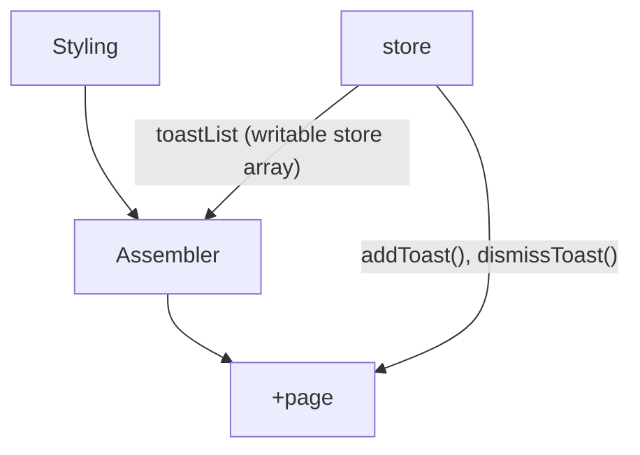

# About RE-Toasts Library
This is my reverse-engineered version of the Svelte toasts example.

## What RE-Toasts Aims to do better
I plan to use this library to make for a simpler way to create toasts on the +page side of the program. This way, I won't need to create variables for every option I need.

Also, unlike the example toast, this one doesn't block the side with an invisible div.

## Limitations of RE-Toasts
For now, it can only do a single non-dismissible toast that automatically goes away on its own. The array part *kind of* works, but can't be used to display multiple toasts. I'll need to implement the Toast ID function for that.

I plan to work on that eventually, although I might as well just put it back but use this as my default toast library so I'd have incentive for working on this every now and then without having to allot time to work specifically work on this. In other words, it works so don't fix it *yet*.

## Current Structure
**Verison:** 1.0.1

**Note:** Individual toasts are stored in toastList as planned, but everything currently gets dismissed at the same time.

## Todo List
- Make each toast dismissible.

## Changelog
**v1.0.0**
- Basic toast notification. Shows only 1 toast at a time, but the toastList stores multiple data as planned.
**v1.0.1**
- Multiple toasts can now show up.